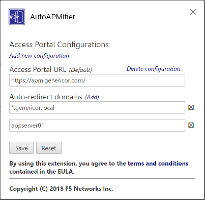

Configuring AutoAPMifier
========================

.. Note:: Before you can configure the extension, you must accept the End-User
   License Agreement. You need to click the link to read the EULA before the
   checkbox to accept the agreement will be enabled.

The Options Screen
------------------

|options|

Access Portal Configurations
++++++++++++++++++++++++++++

You need to define one or more Access Portal Configurations to use the extension.

Adding a new Configuration
^^^^^^^^^^^^^^^^^^^^^^^^^^

#. Click the "Add new configuration" link to add a new APM configuration
#. Enter the URL of your APM Portal.

Default Configuration
^^^^^^^^^^^^^^^^^^^^^

If you have more than one Access Portal configured, you can select which one
is the default configuration. When you click the AutoAPMifier icon in the
extensions area of your browser, it will APMify the active tab through the
default APM.

Auto-Redirect Domains
+++++++++++++++++++++

For each Access Portal configuration, you can define one or more Auto-Redirect
domains. These are the internal domains that AutoAPMifier will watch for and 
redirect through the APM portal.

You can specify either a specific FQDN, or a wildcard to match all subdomains
of a particular domain. If a URL matches both a wildcard domain and an
individual FQDN in differnet APM configurations, the more specific (i.e.:
the individual FQDN) takes precedence.

+-------------------+----------------------------+
| Pattern           | Matches                    |
+===================+============================+
| \*.intdomain.local| | intdomain.local          |
|                   | | app1.intdomain.local     |
|                   | | app2.intdomain.local     |
+-------------------+----------------------------+
| intdomain.local   | | intdomain.local **only** |
+-------------------+----------------------------+
| \*intdomain.local | Not a valid pattern. you   |
|                   | must include a "." after   |
|                   | the asterisk.              |
+-------------------+----------------------------+

Adding a new Auto-Redirect Domain
^^^^^^^^^^^^^^^^^^^^^^^^^^^^^^^^^

#. Click the "Add" link in the "Auto-Redirect Domains" section for the
   appropriate Access Portal configuration.
#. Enter the domain pattern you want to match.

Saving or Resetting the Configuration
+++++++++++++++++++++++++++++++++++++

Changes do not take effect until they are saved. Click the "Save" button to
save and commit the changes, or the "Reset" button to revert back to the
previously saved settings.

